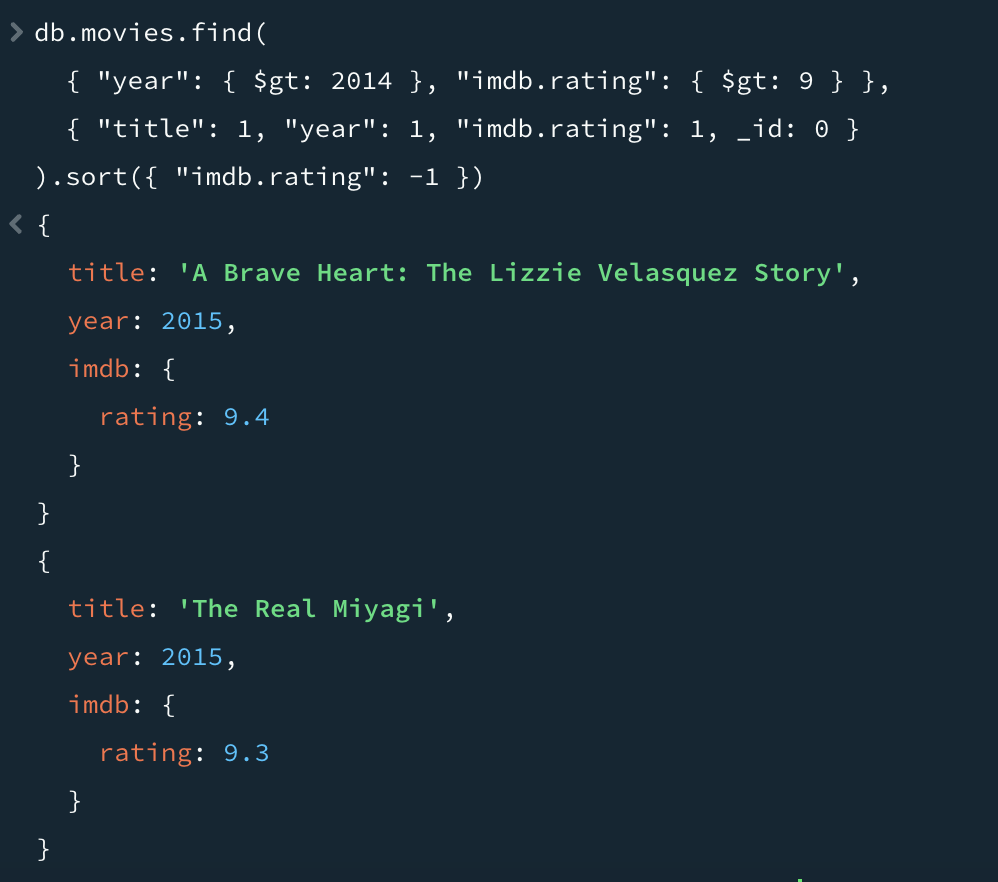
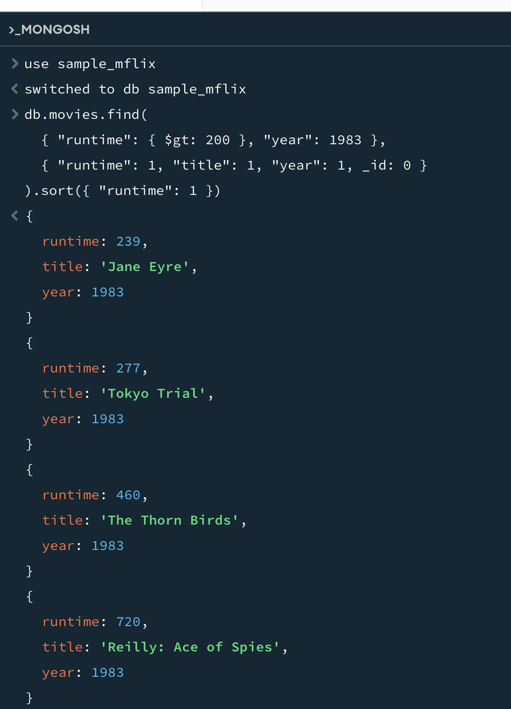

# MongoDB Atlas & Compass Assignment  

## 📌 Assignment Overview  
This assignment demonstrates my ability to set up MongoDB Atlas, install and configure MongoDB Community Edition, run queries in MongoDB Compass, and document my process and results.  

## 📂 Repository Contents  
- **README.md** → This documentation  
- **MongoDB Queries & Results**  
  -   
  -   

## 🔗 MongoDB Setup  
I started by creating a MongoDB Atlas account and setting up a free cluster. I configured a database user, network access, and loaded sample data. Then, I installed MongoDB Community Edition using Homebrew and started the MongoDB service. After that, I connected to MongoDB Compass using the connection string provided by Atlas and verified my connection to the `sample_mflix` database.  

## 📝 Queries & Results  
For the first query, I found all movies with a runtime greater than 200 minutes in the year 1983. I retrieved only the runtime, title, and year fields, and sorted the results by runtime in ascending order. The query used was:  
```javascript
db.movies.find(
  { "runtime": { $gt: 200 }, "year": 1983 },
  { "runtime": 1, "title": 1, "year": 1, _id: 0 }
).sort({ "runtime": 1 })
```
For the second query, I retrieved all movies released after 2014 with an IMDb rating greater than 9. The query returned the title, year, and IMDb rating fields, sorting the results by IMDb rating in descending order. The query used was:
```javascript
db.movies.find(
  { "year": { $gt: 2014 }, "imdb.rating": { $gt: 9 } },
  { "title": 1, "year": 1, "imdb.rating": 1, _id: 0 }
).sort({ "imdb.rating": -1 })
